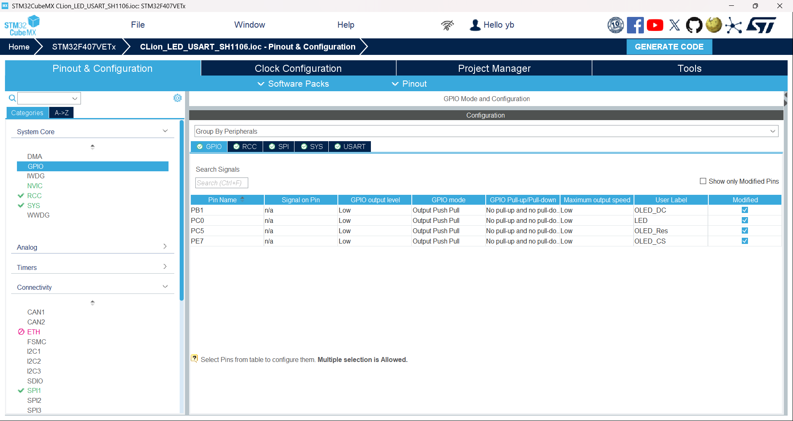
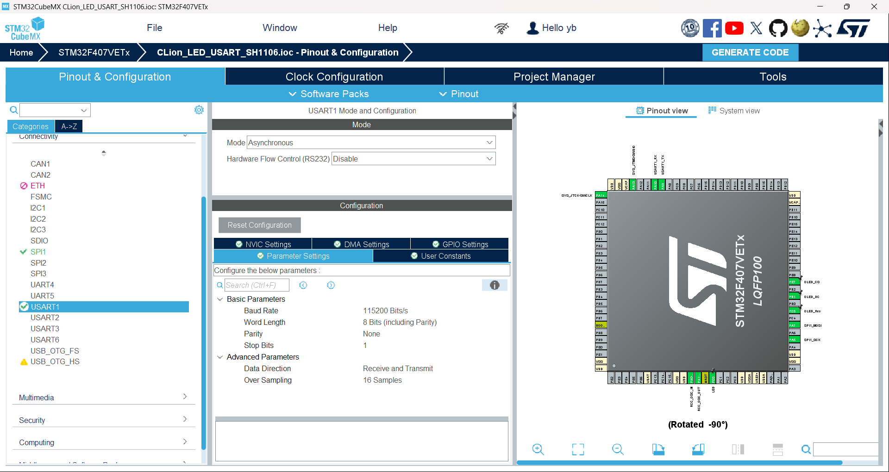
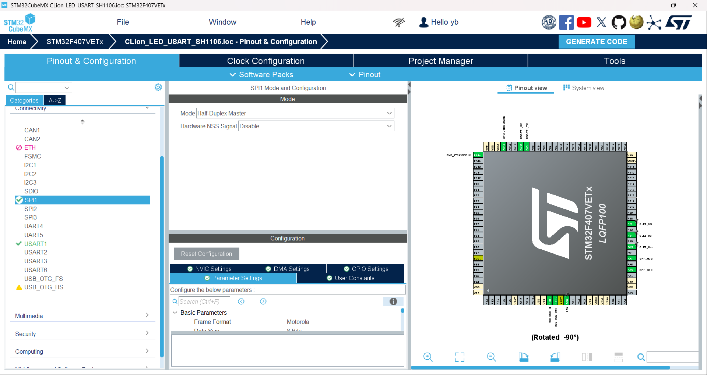
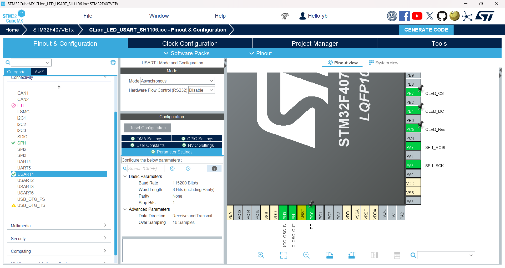

# CLion dev workflow test

- works perfect:11/24/2024 
  - LED
  - USART
  - SH1106
- just for testing 
  - sometimes i always forget to commit🤣🤣 
- configs for initialization
  - gpios
  
  - usart
  
  - usart
  
  - overall
  
# chips and peripherals 
- stm32f407vet6
- cmsis-dap
- sh1106 0.96'' oled
- onboard led linked to pc0
